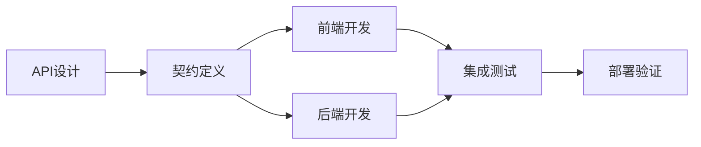

# E-Maintenance API路由不匹配问题分析与解决方案

**文档版本**: v1.0  
**创建日期**: 2025年8月30日  
**问题发现**: 工单状态更新功能完全失效  
**影响范围**: 前后端API集成、用户核心功能体验

---

## 📋 问题概述

在本地Docker部署成功和服务器部署后，工单状态更新功能出现404错误，表现为：
- 用户可以正常登录和浏览系统
- 工单列表显示正常
- **关键问题**: 更新工单状态时前端报错，功能完全失效

**原始错误信息**:
```javascript
PUT http://localhost/api/work-orders/wo005/status 404 (Not Found)
Route /api/work-orders/wo005/status-history not found
```

---

## 🔍 问题分析

### 问题根本原因: **前后端API契约不一致**

经过深入分析，发现了两个独立但相关的路由不匹配问题：

#### 问题1: HTTP方法不匹配
- **前端调用**: `PUT /api/work-orders/:id/status`
- **后端路由**: `POST /:id/status`
- **结果**: 404 Not Found

#### 问题2: 路由路径不匹配  
- **前端调用**: `GET /api/work-orders/:id/status-history`
- **后端路由**: `GET /:id/history`
- **结果**: 404 Not Found

### 为什么会产生这些问题？

#### 1. **开发过程中的API设计变更**
- 后端路由设计时选择了简洁的路径 (`/history`)
- 前端开发时使用了更明确的路径 (`/status-history`)
- 缺乏API契约文档或规范确保一致性

#### 2. **HTTP方法语义理解差异**
- 前端开发者认为状态更新是资源修改，使用PUT方法
- 后端开发者将其设计为操作动作，使用POST方法
- REST API语义理解不统一

#### 3. **缺乏端到端集成测试**
- 前后端独立开发和测试
- 集成测试覆盖不足，未能及早发现路由不匹配
- 本地开发环境可能使用了不同的API调用方式

#### 4. **相关的Nginx配置问题**
- Nginx代理缺少查询参数传递 (`$is_args$args`)
- 导致工单筛选和分页功能失效
- 复合问题使得调试变得复杂

---

## ✅ 解决方案

### 修复1: 统一状态更新HTTP方法

**文件**: `apps/web/lib/services/work-order-service.ts`

```typescript
// 问题代码
async updateWorkOrderStatus(id: string, statusUpdate: UpdateWorkOrderStatusRequest): Promise<WorkOrder> {
  return this.request<WorkOrder>(`/api/work-orders/${id}/status`, {
    method: 'PUT',  // ❌ 与后端不匹配
    body: JSON.stringify(statusUpdate),
  });
}

// 修复后
async updateWorkOrderStatus(id: string, statusUpdate: UpdateWorkOrderStatusRequest): Promise<WorkOrder> {
  return this.request<WorkOrder>(`/api/work-orders/${id}/status`, {
    method: 'POST', // ✅ 与后端路由匹配
    body: JSON.stringify(statusUpdate),
  });
}
```

### 修复2: 统一状态历史路由路径

**文件**: `apps/web/lib/services/work-order-service.ts`

```typescript
// 问题代码
async getWorkOrderStatusHistory(id: string): Promise<WorkOrderStatusHistoryItem[]> {
  const response = await this.request<{ statusHistory: WorkOrderStatusHistoryItem[] }>(
    `/api/work-orders/${id}/status-history`  // ❌ 后端路由不存在
  );
  return response.statusHistory;
}

// 修复后  
async getWorkOrderStatusHistory(id: string): Promise<WorkOrderStatusHistoryItem[]> {
  const response = await this.request<{ statusHistory: WorkOrderStatusHistoryItem[] }>(
    `/api/work-orders/${id}/history`  // ✅ 与后端路由匹配
  );
  return response.statusHistory;
}
```

### 修复3: Nginx查询参数传递

**文件**: `deploy/Server/nginx/deploy.sh`

```nginx
# 问题配置
location /api/work-orders {
    proxy_pass http://work_order_service;  # ❌ 查询参数丢失
}

# 修复后
location ~ ^/api/work-orders(.*)$ {
    proxy_pass http://work_order_service/api/work-orders$1$is_args$args;  # ✅ 完整传递
}
```

---

## 🧪 验证方法

### 1. 路由可达性测试
```bash
# 测试状态更新路由 (应该返回401而非404)
curl -X POST "http://localhost/api/work-orders/wo001/status" \
  -H "Content-Type: application/json" \
  -d '{"status": "IN_PROGRESS"}'

# 预期结果: 401 Unauthorized (路由存在，认证问题)
# 错误结果: 404 Not Found (路由不存在)
```

### 2. 查询参数传递测试
```bash
# 测试工单筛选功能
curl "http://localhost/api/work-orders?status=PENDING&page=1&limit=5"

# 验证后端是否收到完整参数
```

### 3. 前端功能测试
- 登录系统
- 尝试更新工单状态
- 检查浏览器Network面板是否有404错误
- 验证状态更新后是否能正常加载历史记录

---

## 🛡️ 防范措施

### 1. **API契约文档标准化**

#### 建议使用OpenAPI规范
```yaml
# example: work-order-api.yaml
paths:
  /api/work-orders/{id}/status:
    post:  # 明确HTTP方法
      summary: "更新工单状态"
      parameters:
        - name: id
          in: path
          required: true
          schema:
            type: string
      requestBody:
        required: true
        content:
          application/json:
            schema:
              $ref: "#/components/schemas/StatusUpdate"
```

#### 创建API契约验证流程
```bash
# 在CI/CD中添加契约测试
npm run api:contract-test
npm run api:schema-validation
```

### 2. **路由一致性检查工具**

#### 创建路由审计脚本
```bash
#!/bin/bash
# scripts/check-route-consistency.sh

echo "检查前后端路由一致性..."

# 提取前端API调用
grep -r "api/" apps/web/lib/services/ | grep -E "(GET|POST|PUT|DELETE)" > frontend-routes.txt

# 提取后端路由定义  
grep -r "router\." apps/api/*/src/routes/ | grep -E "(get|post|put|delete)" > backend-routes.txt

# 对比和报告不匹配
python scripts/compare-routes.py frontend-routes.txt backend-routes.txt
```

### 3. **集成测试自动化**

#### 端到端API测试
```typescript
// tests/e2e/work-order-status-update.test.ts
describe('Work Order Status Update', () => {
  test('should update status and load history without 404 errors', async () => {
    // 1. 创建测试工单
    const workOrder = await createTestWorkOrder();
    
    // 2. 更新状态 - 不应该有404错误
    const response = await updateWorkOrderStatus(workOrder.id, 'IN_PROGRESS');
    expect(response.status).not.toBe(404);
    
    // 3. 加载历史记录 - 不应该有404错误
    const history = await getWorkOrderHistory(workOrder.id);
    expect(history).toBeDefined();
  });
});
```

#### Postman/Newman集合
```json
{
  "name": "E-Maintenance API Integration Tests",
  "tests": [
    {
      "name": "Work Order Status Update",
      "request": {
        "method": "POST",
        "url": "{{base_url}}/api/work-orders/{{work_order_id}}/status",
        "body": {
          "status": "IN_PROGRESS",
          "notes": "Integration test"
        }
      },
      "tests": [
        "pm.test('Status code should not be 404', function() { pm.expect(pm.response.code).to.not.equal(404); })"
      ]
    }
  ]
}
```

### 4. **开发流程改进**

#### API First开发方法


#### 代码审查清单
- [ ] 前端API调用方法与后端路由HTTP方法一致
- [ ] 前端API路径与后端路由路径完全匹配  
- [ ] 所有查询参数在Nginx配置中正确传递
- [ ] 新增API端点有对应的集成测试
- [ ] API变更已更新契约文档

### 5. **监控和告警**

#### 生产环境API监控
```typescript
// monitoring/api-health-check.ts
const criticalEndpoints = [
  'POST /api/work-orders/:id/status',
  'GET /api/work-orders/:id/history',
  'GET /api/work-orders'
];

async function checkEndpointHealth(endpoint: string) {
  const response = await fetch(endpoint);
  if (response.status === 404) {
    await sendAlert(`Route not found: ${endpoint}`);
  }
}
```

#### Nginx访问日志分析
```bash
# 监控404错误率
tail -f /var/log/nginx/access.log | grep " 404 " | grep "/api/"

# 每日404错误报告
awk '$9 == 404 && $7 ~ /\/api\// {print $7}' /var/log/nginx/access.log | sort | uniq -c
```

---

## 📚 最佳实践总结

### ✅ **DO - 推荐做法**

1. **API契约优先**: 先定义API规范，再分别开发前后端
2. **命名规范统一**: 建立团队统一的路由命名规范
3. **HTTP方法语义**: 遵循REST标准，状态更新使用POST，资源修改使用PUT
4. **集成测试覆盖**: 每个API端点都有对应的集成测试
5. **部署前验证**: 部署流程中包含API可达性检查
6. **监控告警**: 生产环境监控404错误率和API健康状态

### ❌ **DON'T - 避免的问题**  

1. **前后端分离开发**: 避免完全独立开发，缺乏沟通
2. **路由随意命名**: 避免不一致的路由命名风格
3. **HTTP方法滥用**: 避免错误的HTTP方法语义使用
4. **缺乏集成测试**: 避免只有单元测试，缺乏端到端验证
5. **忽略Nginx配置**: 避免忽视反向代理的查询参数传递
6. **手工部署验证**: 避免依赖手工测试，应该自动化验证

---

## 🔗 相关文档

- [已知问题列表](./KNOWN_ISSUES.md) - 完整的部署问题记录
- [API开发规范](../standards/API_DEVELOPMENT_STANDARDS.md) - 待创建
- [集成测试指南](../testing/INTEGRATION_TESTING_GUIDE.md) - 待创建
- [部署验证清单](./DEPLOYMENT_VERIFICATION_CHECKLIST.md) - 待创建

---

**经验教训**: 微服务架构中，前后端API契约一致性是系统稳定运行的基础。建立自动化的契约验证和集成测试机制，能够在开发阶段就发现并修复此类问题，避免影响用户体验。

**维护说明**: 当添加新的API端点或修改现有端点时，请参考本文档的防范措施，确保前后端保持一致。

*最后更新: 2025-08-30*