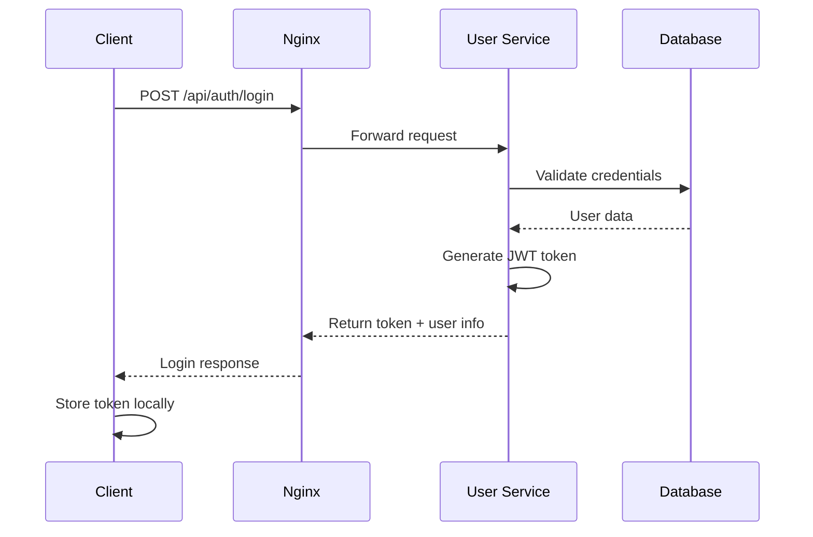
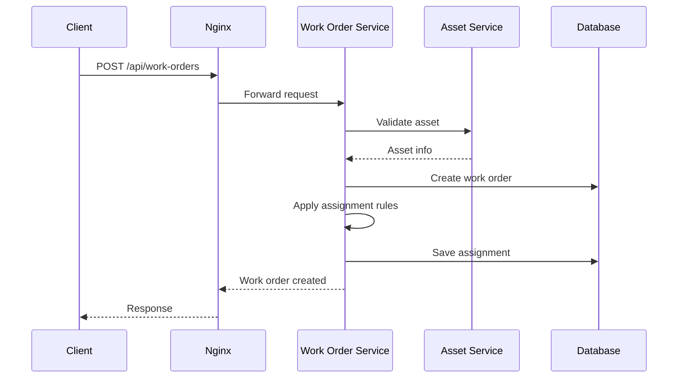
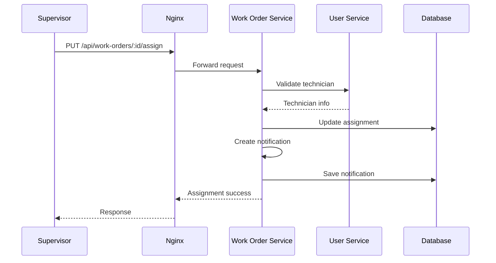

# E-Maintenance 系统架构分析

## 项目概述

E-Maintenance 是一个现代化的企业设备维修管理系统，采用微服务架构、容器化部署，支持多端访问（Web端、移动端）的全栈解决方案。

## 总体架构

### 1. 技术栈概览

**前端技术栈**
- **Web**: Next.js 14+ (App Router) + React 18+ + TypeScript
- **Mobile**: Flutter 3.22+ (Dart)
- **UI框架**: shadcn/ui + Tailwind CSS
- **状态管理**: Zustand (Web) + Provider模式 (Flutter)

**后端技术栈**
- **微服务**: Node.js + Express.js + TypeScript
- **数据库**: PostgreSQL 16+ + Prisma ORM
- **缓存**: Redis 7+
- **认证**: JWT + bcrypt
- **文件存储**: 本地文件系统 + 多媒体处理

**DevOps技术栈**
- **构建工具**: Turborepo (Monorepo管理)
- **容器化**: Docker + Docker Compose
- **反向代理**: Nginx
- **部署**: 分层部署脚本 + 健康检查

## 2. 系统架构图

```
                          【用户层】
    ┌─────────────────┐                    ┌─────────────────┐
    │   Web 前端      │                    │   移动端 App    │
    │  (Next.js)      │                    │   (Flutter)     │
    │  Port: 3000     │                    │   iOS/Android   │
    └─────────────────┘                    └─────────────────┘
             │                                       │
             └─────────────┐           ┌─────────────┘
                           │           │
                    ┌─────────────────┐
                    │  Nginx 反向代理  │
                    │  Port: 3030     │
                    └─────────────────┘
                           │
             ┌─────────────┼─────────────┐
             │             │             │
    ┌─────────────┐ ┌─────────────┐ ┌─────────────┐
    │ 用户服务    │ │ 工单服务    │ │ 资产服务    │
    │Port: 3001   │ │Port: 3002   │ │Port: 3003   │
    │             │ │             │ │             │
    │• 认证授权   │ │• 工单管理   │ │• 资产管理   │
    │• 用户管理   │ │• 任务分配   │ │• QR码生成   │
    │• 权限控制   │ │• 通知系统   │ │• 维护历史   │
    │• 设置管理   │ │• KPI统计    │ │• 文件上传   │
    └─────────────┘ └─────────────┘ └─────────────┘
             │             │             │
             └─────────────┼─────────────┘
                           │
                  ┌─────────────────┐
                  │   数据存储层    │
                  │                 │
            ┌─────────────┐   ┌─────────────┐
            │ PostgreSQL  │   │   Redis     │
            │ Port: 5432  │   │ Port: 6379  │
            │             │   │             │
            │• 主数据存储 │   │• 缓存       │
            │• 事务处理   │   │• 会话存储   │
            │• 数据一致性 │   │• 消息队列   │
            └─────────────┘   └─────────────┘
```

## 3. 微服务架构详解

### 3.1 用户服务 (User Service)
**端口**: 3001  
**职责**: 认证、授权、用户管理、系统设置

**核心功能模块**:
- **认证控制器** (`AuthController`): JWT登录、密码验证、会话管理
- **用户控制器** (`UserController`): CRUD操作、角色管理、权限控制
- **资产控制器** (`AssetController`): 用户相关资产查询
- **导入控制器** (`ImportController`): 批量数据导入
- **设置控制器** (`SettingsController`): 系统配置管理

**安全特性**:
- 分层速率限制 (查看: 1000/15分钟, 写操作: 50/15分钟)
- JWT令牌验证
- bcrypt密码加密
- CORS跨域保护

### 3.2 工单服务 (Work Order Service)  
**端口**: 3002  
**职责**: 工单生命周期管理、任务分配、通知系统

**核心功能模块**:
- **工单控制器** (`WorkOrderController`): 工单CRUD、状态管理、统计分析
- **分配规则控制器** (`AssignmentRuleController`): 自动分配规则
- **通知控制器** (`NotificationController`): 系统通知管理

**业务流程**:
```
创建工单 → 自动分配 → 状态跟踪 → 完成解决 → 历史记录
   ↓         ↓         ↓         ↓         ↓
 验证资产   规则匹配   进度更新   照片上传   统计分析
```

**文件处理**:
- 照片上传 (`PhotoStorageService`)
- 多媒体文件管理
- 缩略图生成

### 3.3 资产服务 (Asset Service)
**端口**: 3003  
**职责**: 资产管理、QR码生成、维护历史

**核心功能模块**:
- **资产控制器** (`AssetController`): 资产CRUD、QR码管理
- **维护历史**: 资产相关工单记录
- **QR码生成**: 唯一标识码生成

## 4. 数据架构

### 4.1 数据库设计 (PostgreSQL + Prisma)

**核心实体关系**:
```
User (用户) ──┐
             ├── WorkOrder (工单)
Asset (资产) ─┘       │
                      ├── WorkOrderStatusHistory (状态历史)
                      ├── WorkOrderPhoto (工单照片)
                      └── Notification (通知)
                           │
Category (分类) ──────────┼── AssignmentRule (分配规则)
Location (位置) ──────────┘
FaultCode (故障代码)
Reason (原因)
PriorityLevel (优先级)
```

**关键表结构**:
- **User**: 用户信息、角色权限 (EMPLOYEE, TECHNICIAN, SUPERVISOR, ADMIN)
- **Asset**: 资产信息、QR码、位置绑定
- **WorkOrder**: 工单核心数据、状态跟踪
- **AssignmentRule**: 智能分配规则配置

### 4.2 缓存策略 (Redis)
- **会话缓存**: JWT令牌黑名单
- **查询缓存**: 频繁查询的主数据
- **消息队列**: 异步通知处理

## 5. 前端架构

### 5.1 Web前端架构 (Next.js)
```
app/                          # Next.js App Router
├── dashboard/               # 主要功能页面
│   ├── assets/             # 资产管理
│   ├── work-orders/        # 工单管理
│   ├── users/              # 用户管理
│   └── assignment-rules/   # 分配规则
├── login/                  # 登录页面
└── api/                    # API路由

components/                   # React组件库
├── ui/                     # 基础UI组件 (shadcn/ui)
├── forms/                  # 表单组件
├── supervisor/             # 主管功能组件
├── work-orders/            # 工单相关组件
└── assets/                 # 资产相关组件

lib/
├── services/               # API调用服务
├── stores/                 # Zustand状态管理
└── types/                  # TypeScript类型定义
```

**状态管理架构**:
- **认证状态**: `auth-store` (全局用户状态)
- **工单管理**: `work-order-store` (工单列表、筛选、创建)
- **用户管理**: `user-management-store` (用户CRUD)
- **资产管理**: `asset-management-store` (资产管理)
- **分配系统**: `assignment-store` (分配规则管理)

### 5.2 移动端架构 (Flutter)
```
lib/
├── features/               # 功能模块
│   ├── auth/              # 认证
│   ├── work_orders/       # 工单管理
│   ├── assets/            # 资产管理
│   ├── scanner/           # QR码扫描
│   └── photo/             # 照片拍摄
├── shared/
│   ├── services/          # API服务
│   ├── models/            # 数据模型
│   └── providers/         # 状态管理
└── main.dart
```

**核心功能**:
- **QR码扫描**: 快速资产识别
- **离线工作**: 本地数据存储
- **照片拍摄**: 现场问题记录
- **同步机制**: 在线/离线数据同步

## 6. 部署架构

### 6.1 容器化部署结构
```
Docker 容器组
├── Infrastructure Layer (基础设施层)
│   ├── PostgreSQL (数据库)
│   └── Redis (缓存)
├── Application Layer (应用层)  
│   ├── User Service (用户服务)
│   ├── Work Order Service (工单服务)
│   ├── Asset Service (资产服务)
│   └── Web Application (Web前端)
└── Gateway Layer (网关层)
    └── Nginx (反向代理 + 负载均衡)
```

### 6.2 网络架构
```
Internet
    ↓
Nginx (Port: 3030) ──┐
    ↓                │
Docker Network       │ 
emaintenance-network │
    ├── web:3000         │ (对外端口映射)
    ├── user-service:3001     ├── :3001
    ├── work-order-service:3002   ├── :3002  
    ├── asset-service:3003    ├── :3003
    ├── postgres:5432     └── :5432
    └── redis:6379            :6379
```

### 6.3 部署流程

**分层部署策略**:
1. **基础设施层** (`infrastructure/deploy.sh`)
   - PostgreSQL + Redis 启动
   - 网络和存储卷创建
   
2. **应用服务层** (按依赖顺序)
   - User Service (认证服务优先)
   - Work Order Service  
   - Asset Service
   
3. **前端应用层**
   - Web Application 构建部署
   
4. **网关代理层**
   - Nginx 配置和启动

**部署脚本特性**:
- **依赖检查**: 确保服务按顺序启动
- **健康检查**: 每个服务有独立健康检查端点
- **环境隔离**: 开发/生产环境配置分离
- **滚动更新**: 零停机部署支持
- **回滚机制**: 快速回滚到上一版本

## 7. 安全架构

### 7.1 认证与授权
```
客户端请求
    ↓
JWT Token 验证 (中间件)
    ↓
角色权限检查 (RBAC)
    ↓  
资源访问控制
    ↓
业务逻辑处理
```

**角色权限体系**:
- **EMPLOYEE**: 基础工单创建和查看
- **TECHNICIAN**: 工单分配和技术更新  
- **SUPERVISOR**: 团队管理、KPI仪表板、用户/资产管理
- **ADMIN**: 全系统管理权限

### 7.2 网络安全
- **反向代理**: Nginx作为单一入口点
- **速率限制**: API和Web访问频率控制
- **CORS保护**: 跨域请求限制
- **安全头**: XSS、CSRF、点击劫持防护

### 7.3 数据安全
- **加密存储**: bcrypt密码哈希
- **数据校验**: Zod/Joi输入验证
- **SQL注入防护**: Prisma ORM参数化查询
- **文件上传安全**: 类型检查和大小限制

## 8. 系统流程图

### 8.1 用户登录流程


### 8.2 工单创建流程  


### 8.3 工单分配流程


## 9. 性能优化策略

### 9.1 数据库优化
- **连接池**: 最大200连接，共享缓冲区256MB
- **查询优化**: 慢查询日志(>1000ms)
- **索引策略**: 主要查询字段建立复合索引
- **分页查询**: 大数据集分页加载

### 9.2 缓存策略
- **Redis缓存**: 热点数据256MB LRU策略
- **浏览器缓存**: 静态资源1年缓存
- **API响应缓存**: 查询结果临时缓存

### 9.3 前端优化
- **代码分割**: Next.js动态导入
- **图片优化**: Sharp图片处理，多尺寸适配
- **Bundle优化**: Tree-shaking移除未使用代码
- **Service Worker**: 离线缓存支持

## 10. 监控与日志

### 10.1 日志架构
```
应用日志 → Winston/Console → Docker logs → 宿主机文件
         ↓
    日志轮转(10MB/文件, 3个文件)
         ↓
    集中日志分析 (可扩展ELK栈)
```

### 10.2 健康监控
- **服务健康检查**: 每个服务暴露/health端点
- **容器监控**: Docker容器状态跟踪  
- **数据库监控**: 连接池、查询性能监控
- **业务指标**: KPI仪表板实时监控

## 11. 扩展性设计

### 11.1 微服务扩展
- **水平扩展**: Docker Swarm/Kubernetes支持
- **服务发现**: 容器网络自动发现
- **负载均衡**: Nginx upstream配置
- **数据库读写分离**: 主从复制准备

### 11.2 功能扩展
- **插件系统**: 预留扩展接口
- **工作流引擎**: 复杂业务流程支持
- **报表系统**: BI集成接口
- **第三方集成**: ERP、OA系统对接

## 12. 技术债务与改进建议

### 12.1 当前技术债务
- **构建产物**: dist/coverage目录应加入.gitignore
- **控制台日志**: 生产环境应使用结构化日志
- **JWT解码**: 客户端JWT解析应移至服务端
- **资产服务**: 路由定义不完整，需补充中间件集成

### 12.2 架构改进建议
1. **引入API网关**: Kong/Zuul统一API管理
2. **服务网格**: Istio/Linkerd增强服务间通信
3. **消息队列**: RabbitMQ/Apache Kafka异步处理
4. **搜索引擎**: Elasticsearch全文搜索
5. **监控告警**: Prometheus + Grafana监控栈
6. **CI/CD流水线**: Jenkins/GitHub Actions自动化部署

### 12.3 安全增强
1. **API网关认证**: 统一认证中心
2. **网络安全**: VPN/防火墙规则
3. **数据加密**: 敏感数据字段加密
4. **审计日志**: 操作行为完整记录
5. **漏洞扫描**: 定期安全扫描

## 总结

E-Maintenance系统采用现代化微服务架构，具备良好的可扩展性和维护性。系统在架构设计、安全防护、性能优化等方面都有较好的基础，为企业设备维修管理提供了完整的数字化解决方案。

通过持续的架构优化和技术债务清理，系统可以进一步提升性能、可靠性和用户体验。