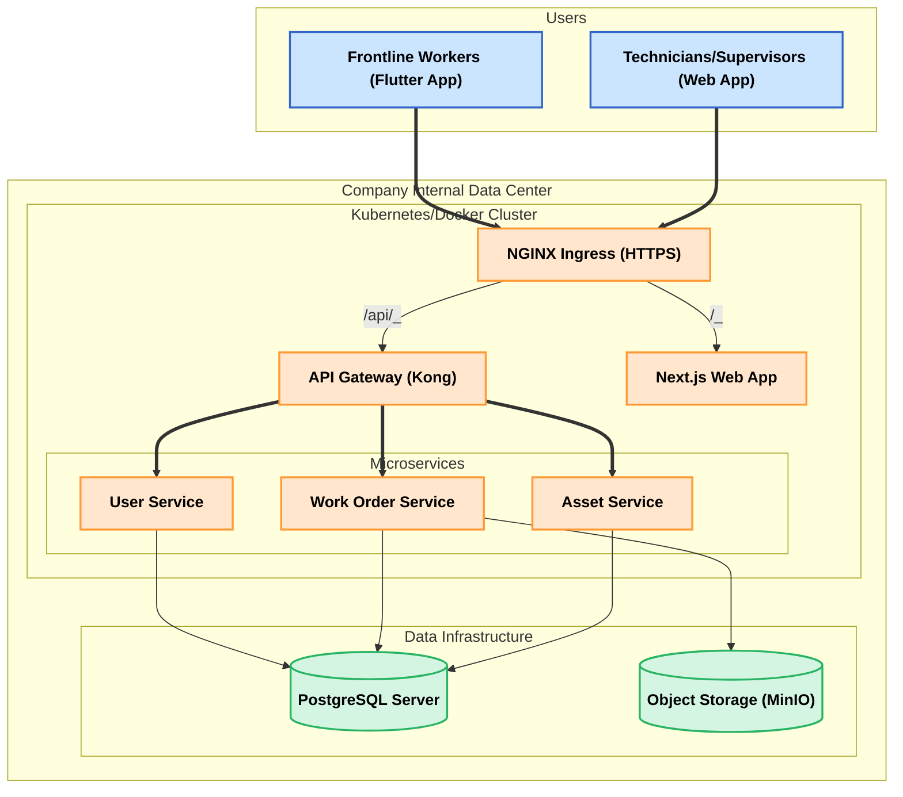

# 全栈架构文档: 企业设备维修管理程序 v1.0

## 1. 简介

本文档概述了企业设备维修管理程序的完整全栈架构，包括前端、后端、部署和开发工作流，旨在为 AI 驱动的开发提供清晰的技术蓝图。项目将使用 Turborepo 管理的 Monorepo 结构从零开始构建。

## 2. 高层架构

- **部署模型**: 基于公司内部服务器的本地化部署 (On-Premise)
- **核心平台**: 内部服务器集群，使用 Kubernetes 进行容器编排，并部署 NGINX 作为 Ingress Controller 处理所有外部 HTTPS 流量
- **架构模式**: 后端采用微服务架构，前后端通过 API 网关进行通信

### 架构图

## 3. 技术栈

- **前端**: Next.js v14+ (Web), Flutter v3.22+ (Mobile)
- **后端**: Node.js v20.x, Prisma v5+, PostgreSQL v16+
- **CI/CD**: Gitea + Jenkins
- **监控/日志**: Prometheus & Grafana, ELK Stack/Loki
- **其他**: 详见之前确认的完整技术栈表格

## 4. 数据模型

定义了 User, Role, Asset, 和 WorkOrder 四个核心模型及其关系。User 模型已包含 employeeId 和 domainAccount 以支持未来 SSO 集成。Asset 模型已包含 owner 和 administrator。

## 5. API 规范

采用 REST API 风格，使用 OpenAPI 3.0 标准进行定义。API 网关作为统一入口，管理对后端微服务的访问。

## 6. 组件

后端按职责划分为 UserService, WorkOrderService, AssetService 三个核心微服务。前端分为 WebApp (Next.js)和 MobileApp (Flutter)两个应用。

## 7. 核心工作流

定义了"创建新维修工单"的序列图，明确了各组件间的交互流程。

## 8. 数据库表结构

提供了完整的 SQL DDL，用于在 PostgreSQL 中创建所有需要的表、关系和索引。

## 9. 前端架构

- **组件**: 采用分层结构(ui, layout, features, forms)和标准化的编码模板
- **状态管理**: 使用 Zustand，并按业务领域划分 Store
- **路由**: 使用 Next.js App Router，并通过在布局中检查认证状态来保护路由
- **服务层**: 创建统一的 API 客户端，将 API 调用逻辑与 UI 组件分离

## 10. 后端架构

- **内部结构**: 微服务采用控制器-服务-仓库分层模式
- **数据访问**: 使用仓库模式封装 Prisma 调用
- **认证授权**: 基于 JWT 实现无状态认证，API 网关负责 Token 校验，微服务内部通过守卫实现基于角色的授权

## 11. 统一项目结构

定义了基于 Turborepo 的 Monorepo 目录结构，清晰划分了 apps 和 packages。

## 12. 开发工作流

规定了本地开发环境的先决条件、一次性安装步骤和日常开发命令。

## 13. 部署架构

采用基于 Kubernetes 的蓝绿部署策略，CI/CD 流程由 Jenkins 驱动，与 Gitea 集成。

## 14. 安全与性能

定义了 HTTPS、网络隔离、输入验证、代码分割、数据库索引和缓存等一系列安全与性能优化策略。

## 15. 测试策略

遵循测试金字塔模型，对单元测试、集成测试和 E2E 测试的组织方式和目标进行了定义。

## 16. 编码标准

- **Monorepo Structure**: 所有代码必须遵循已定义的 apps/和 packages/结构
- **Component Pattern**: React 组件必须遵循已提供的模板
- **State Management**: 状态应通过领域特定的 Zustand stores 进行管理
- **Service Layer**: 所有 API 通信必须通过定义的服务层进行
- **Backend Pattern**: 后端服务必须遵循控制器-服务-仓库模式
