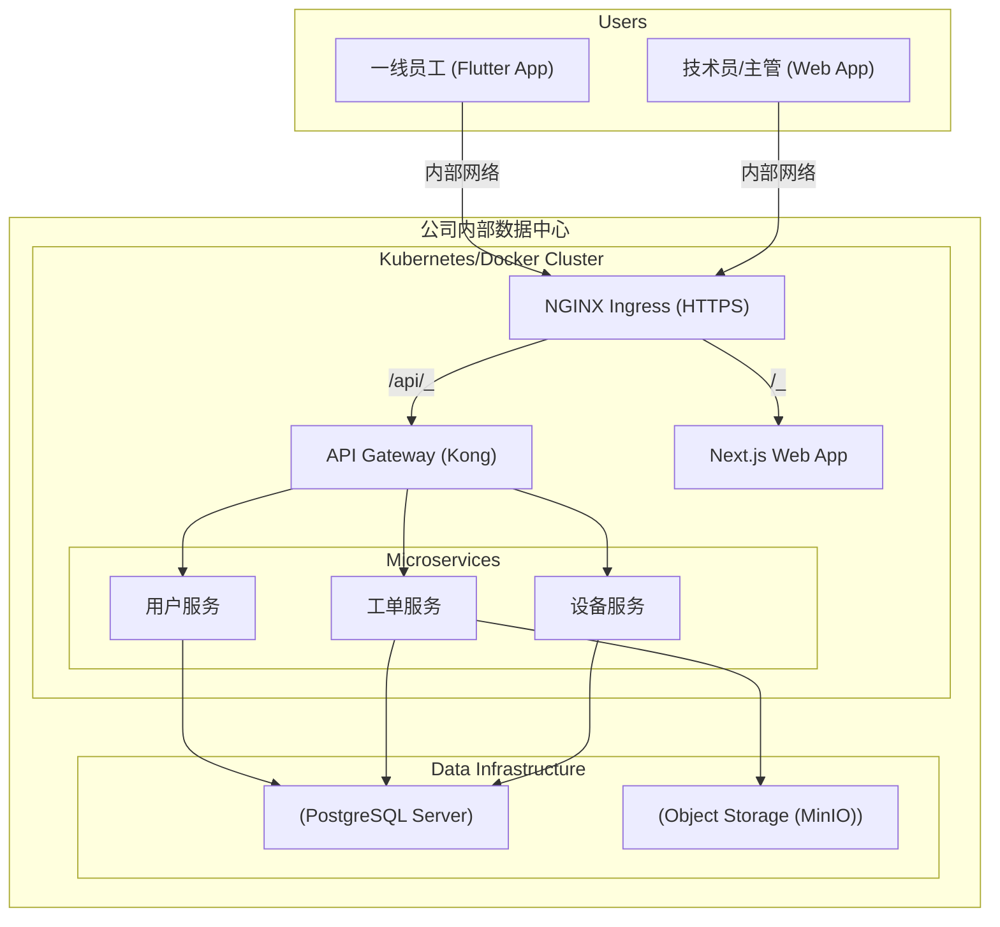

# 2. 高层架构

- **部署模型**: 基于公司内部服务器的本地化部署 (On-Premise)
- **核心平台**: 内部服务器集群，使用 Kubernetes 进行容器编排，并部署 NGINX 作为 Ingress Controller 处理所有外部 HTTPS 流量
- **架构模式**: 后端采用微服务架构，前后端通过 API 网关进行通信

## 架构图

```mermaid
graph TD
subgraph "Users"
U1["一线员工 (Flutter App)"]
U2["技术员/主管 (Web App)"]
end
subgraph "公司内部数据中心"
subgraph "Kubernetes/Docker Cluster"
NGINX["NGINX Ingress (HTTPS)"]
AG["API Gateway (Kong)"]
subgraph "Microservices"
MS1[用户服务]
MS2[工单服务]
MS3[设备服务]
end
WebApp["Next.js Web App"]
end
subgraph "Data Infrastructure"
DB["(PostgreSQL Server)"]
S3["(Object Storage (MinIO))"]
end
end
U1 -- 内部网络 --> NGINX
U2 -- 内部网络 --> NGINX
NGINX -- /api/_ --> AG
NGINX -- /_ --> WebApp
AG --> MS1; AG --> MS2; AG --> MS3
MS1 --> DB; MS2 --> DB; MS3 --> DB; MS2 --> S3
```
